# Fundamentos de Bases de Datos


Documentación y Material ADICIONAL de la asignatura de Fundamentos de Bases de Datos. En este repositorio se incluirá toda la információn EXTRA de la asignatura que ayudará a su estudio y trabajo tanto para la parte de Teoría como para la parte de Prácticas.

Grado en Ingeniería Informática. Universidad de Granada.

Profesor Grupo A-A1: Manuel Parra-Royón  (manuelparra@cern.ch | manuelparra@ugr.es)

<HR>
	Tabla de Contenido
<HR>	

- [Material de Teoría](#material-de-teor-a)
  * [Tema 3 Modelo de Datos](#tema-3-modelo-de-datos)
  	+ [Proceso de análisis y diseño de la Base de Datos](#proceso-de-an-lis-y-dise-o-de-la-base-de-datos)
  	+ [Transformación del modelo lógico de la base de datos](#transformaci-n-del-modelo-l-gico-de-la-base-de-datos)
  	+ [Modelos basados en Registros](#modelos-basados-en-registros)
  	+ [Modelo Jerárquico](#modelo-jer-rquico)
- [Prácticas](#pr-cticas)
  * [Traspaso de Modelo E/R a Tablas](#traspaso-de-modelo-e-r-a-tablas)
    + [Traspaso de Entidades Fuertes](#traspaso-de-entidades-fuertes)
    + [Traspaso de Entidades Débiles](#traspaso-de-entidades-d-biles)
    + [Traspaso de Relaciones](#traspaso-de-relaciones)
    + [Traspaso de relaciones de Herencia](#traspaso-de-relaciones-de-herencia)

# Material de Teoría

## Tema 3 Modelo de Datos

Cuando necesitamos desarrollar una aplicación, un software, o un sistema, lo más probable es que requiera de una Base de Datos. Para ello, antes de empezar directamente con la implementación en un SGBD, es necesario realizar un estudio del problema al que nos enfrentamos.

En ese estudio se traspasa la información del problema de mundo real a un problema a un esquema o modelo que permite representar esa información de un modo más preciso y estructurado que con lenguaje natural.

Por ejemplo tenemos un enunciado de problema:

- "Un autor escribe libros ....", "Los libros tienen título, isbn, ....", "Los libros tratan de materias ...." 

Este enunciado se puede transformar en algo como :

- Libros (isbn, título, ...)
- Autor (nombre, nacionalidad, ...)
- ...

Esta información puede ser transformada en un diagrama que corresponde a un Modelo Entidad/Relación:

El modelado de datos, debe constar de:
- Notación para describir los datos.
- Notación para describir operaciones.
- Notación para describir reglas de integridad.


## Proceso de análisis y diseño de la Base de Datos

El proceso completo de implementación (desde el planteamiento del problema, la creación del modelado E/R hasta el trabajo en la Base de Datos ) de una Base de Datos sigue el siguiente esquema de operaciones:

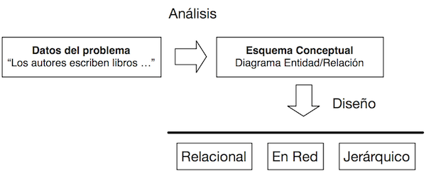

## Transformación del modelo lógico de la base de datos

Traducimos el Modelo E/R a una estructura implementable, como por ejemplo:

- Pasamos la Entidad `Libro` a una tabla:

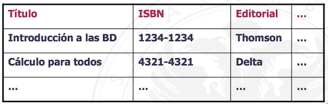

- Se implementa en un sistema comercial (ORACLE, MySQL, PostgreSQL, etc).

```
CREATE TABLE LIBROS (
   titulo char(45) NOT NULL,
   ISBN char(10) PRIMARY KEY, 
   editorial char(30) REFERENCES 
   ...
);
```

**¿Por qué necesito un modelo de datos?**

Se requiere un modelo de datos para describir los datos de algún modo. Un esquema se describe utilizando un DDL (Lenguaje de Definición de Datos). Este lenguaje es de bajo nivel, ya que tiene que conocer detalles de la implementación de los datos, como el tipo de dato, el tamaño, etc. Además está muy ligado al SGDB; por ejemplo el SGBD ORACLE tiene una forma concreta de definir los datos, MySQL/MAriaDB otra forma y SQLite tiene otra distinta.

- Importante: El modelado de datos permiten describir los datos de un modo entendible y manipulable.

## Modelos basados en Registros

Son tres tipos de modelos basados en una estructura de Registros:
- Modelo Jerarquico.
- Modelo en RED.
- Modelo Relacional.


## Modelo Jerárquico

Fue la primera propuesta que se desarrolló. Para el nivel externo se usaba COBOL (muy utilizado en Bancos). La estructura sigue un modelo de Árbol:


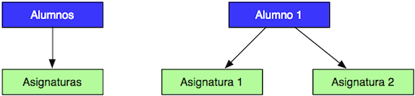


El modelo jerarquico gestiona bien las relaciones uno-muchos, uno a uno, pero no es muy eficiente cuando se trata de relaciones muchos a muchos. Este tipo de relaciones Muchos a Muchos en modelo Jerárquico supone DUPLICAR TODA LA INFORMACIÓN (registros):

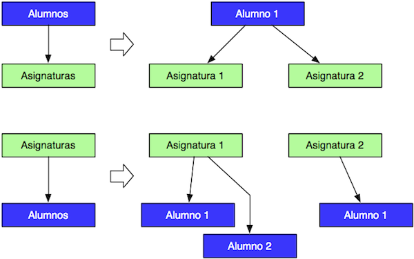

¿Cuáles son los problemas del modelo Jerárquico?

- El almacenamiento del modelo jerárquico (árbol) es complejo.
- El DDL (Data Definition Language) es complejo.
- Los registros existen siempre que exista un registro "padre" en el árbol.
- Contiene mucha redundancia, hay datos duplicados. Por lo que si modificamos un registro hay que modificarlo en todos los lugares donde aparece para que no se pierda la integridad de los datos.

## Modelo en red

Se fundamenta en el modelo de GRAFOS, es decir una estructura que contiene 
nodos, enlaces (o arcos, punteros) y relaciones entre nodos o conjuntos de nodos.

Algunas características:
- Conectores de las relaciones: enlazan a los atributos propios de la relación.
- Cada conector es una asociación diferente.
- Cualquier registro puede relacionarse con cualquier otro.

La base de datos está formada por un conjunto de GRAFOS.

El ejemplo genérico podría verse como la información de Facebook, relaciona a personas y eventos, amistades, comentarios, etc.:


Un ejemplo concreto sería:

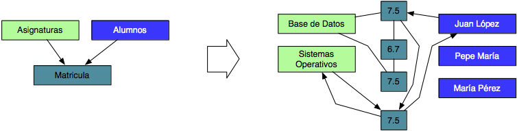

En el ejemplo, cada uno de los registros está conectado con otros registros de varias formas, de modo que si queremos conocer las notas del alumno  Juan Lopez, tenemos que seguir los "punteros"" que salen del alumno hacia los demás registros:
por ejemplo 7.5 en Sistemas Operativos.


# Prácticas 

## Traspaso de Modelo E/R a Tablas

Para concretar los pasos para hacer el paso de Modelo de E/R (diagrama) a paso a tablas, vamos a trabajar con el diagrama siguiente:

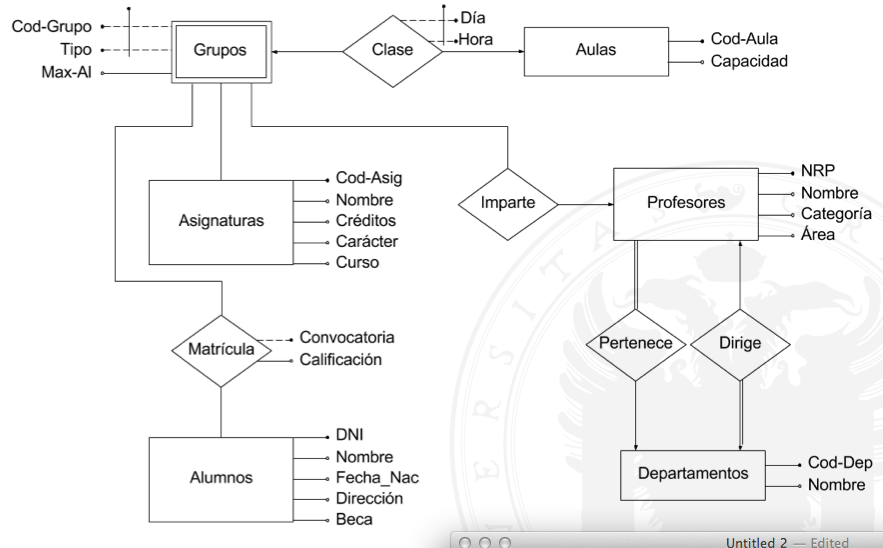

El procedimiento general para pasar a tablas un diagrama de un Modelo de E/R es el siguiente:

### Traspaso de Entidades Fuertes

1.- Vemos cuales son las Entidades Fuertes del Modelo E/R:
 - a) Anotamos cada una de las **entidades fuertes**.
 - b) Incluimos todos sus atributos.
 - c) Marcar el/los atributo/s que son Clave Primaria (**CP**)

Por tanto para le diagrama las Entidades Fuertes con los atributos y claves primarias son las siguientes: 

```
Asignaturas(Cod_asig,...);  

Aulas(Cod_aula,...);

Alumnos(DNI,...);

Profesores(NRP,...);

Departamentos(Cod_dep,...);
```

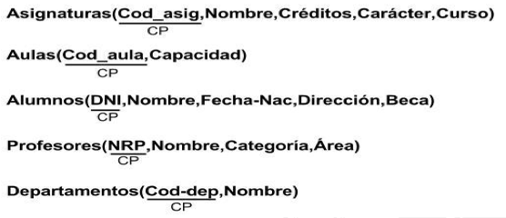

### Traspaso de Entidades Débiles

2.- Vemos cuales son las de entidades débiles del diagrama de E/R:
 - a) Anotamos todas  las entidades débiles.
 - b) Incluimos los atributos que son Clave Primaria de la entidad debil.
 - c) Buscamos en las Entidades Fuertes con las que está unida la relación:
 - c1) Anotamos  los atributos que son Clave Primara en las Entidades Fuertes conectadas.
 
```
Asignaturas(Cod_asig,...)
Grupos(Cod_asig, Cod_grupo, Tipo,...)
```

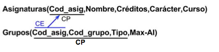

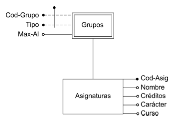


### Traspaso de Relaciones

3.- Tradución del conjunto de relaciones del modelo E/R:
 - a) Anotamos todas las relaciones que unen a las entidades.
 - b) Incluimos los atributos propios de la relación.
 - c) Añadimos los atributos de las claves primarias de las entidades que están conectadas.
	
A tener en cuenta (mucho cuidado):
 - **Si la relación es muchos a muchos**:
	- La clave primaria está formada por todos los atributos de las Entidades involucradas
 - **Si la relación es mucho a uno**:
	- La clave primaria está formada por todos los atributos de las Entidades con cardinalidad de tipo *muchos*.
 - **Relaciones uno a uno**:
	- Tiene al menos dos claves candidatas (de las relaciones involucradas). Pero hay que seleccionar una como clave primaria y otra como clave candidata.

Ejemplo para muchos a muchos:

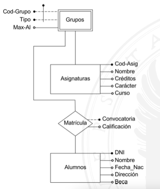

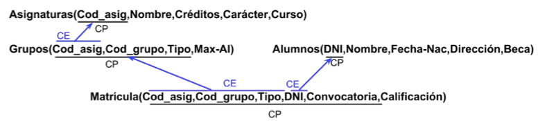


### Traspaso de relaciones de Herencia

4.- Traducción del conjunto de relaciones de Herencia:
 - a) Anotamos las entidades más generales (padre) y sus atributos propios.
 - b) Anotamos las relaciones de los conjuntos heredados:
  - b1) Añadimos los atributos de la relación y los atributos de clave primaria que se heredan del padre.

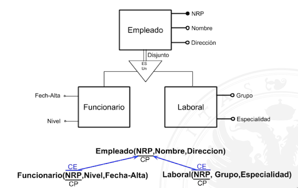

### Traspaso de agregaciones

4.- Traducción del conjunto de agregación:
 - No se traducen a nuevas tablas

### Traspaso de relaciones con Cardinalidades N-arias

5.- Cardinalidad en relación Muchos a Muchos a Muchos
 - a) Se toma la relación que une varias entidades (mas de dos entidades).
 - b) Se anotan los atributos propios de la relación si existen.
 - c) Se anotan las claves primarias de las entidades involucradas como claves externas.
 - d) Se marcan como clave primaria única las claves externas del paso c
 
6.- Cardinalidad en relación Muchos a Muchos a Uno
 - a) Se toma la relación que une varias entidades (mas de dos entidades).
 - b) Se anotan los atributos propios de la relación si existen.
 - c) Se anotan las claves primarias de las entidades involucradas como claves externas.
 - d) Se marcan como clave primaria única las claves externas de las relaciones con cardinalidad Muchos.

7.- Cardinalidad en relación Muchos a Uno a Uno
 - a) Se toma la relación que une varias entidades (mas de dos entidades).
 - b) Se anotan los atributos propios de la relación si existen.
 - c) Se anotan las claves primarias de las entidades involucradas como claves externas.
 - d) Se marcan como clave primaria única las claves externas de las relaciones con cardinalidad Muchos.

8.- Cardinalidad en relación Muchos a Uno a Uno
 - a) Se toma la relación que une varias entidades (mas de dos entidades).
 - b) Se anotan los atributos propios de la relación si existen.
 - c) Se anotan las claves primarias de las entidades involucradas como claves externas.
 - d) Se marcan como clave primaria única las claves externas de las relaciones con cardinalidad Muchos.
 
8.- Cardinalidad en relación Uno a Uno a Uno
 - a) Se toma la relación que une varias entidades (mas de dos entidades).
 - b) Se anotan los atributos propios de la relación si existen.
 - c) Se anotan las claves primarias de las entidades involucradas como claves externas.
 - d) Se marcan como clave primaria cada una de las claves externas.
 


## Fusión de tablas

### Traspaso relaciones Muchos a Uno

Para ello tenemos:

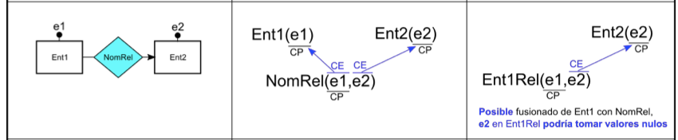


### Traspaso relaciones Muchos a Uno con atributo discriminadores

Para ello tenemos:

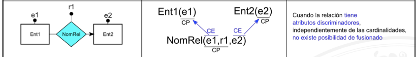


### Traspaso relaciones Muchos (relación obligatoria) a Uno 

Para ello tenemos:

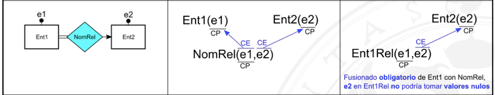


### Traspaso relaciones de Herencia

Para ello tenemos:

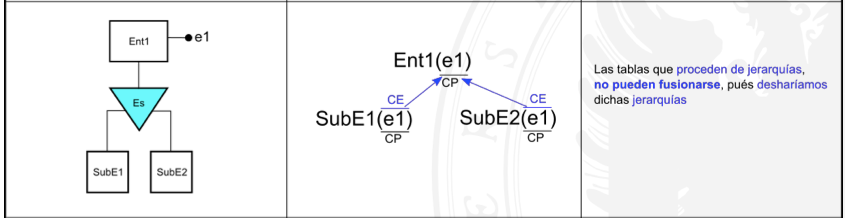


### Traspaso relaciones Uno a Uno

Para ello tenemos:

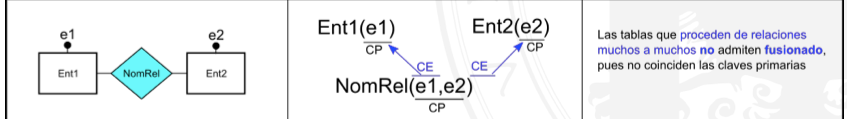


