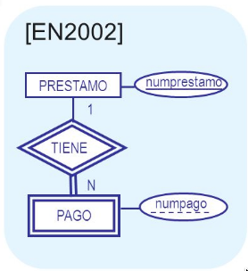
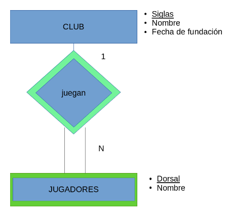
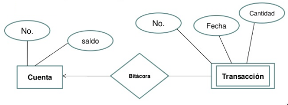

# Fundamentos de Bases de Datos


Documentación y Material ADICIONAL de la asignatura de Fundamentos de Bases de Datos. En este repositorio se incluirá toda la információn EXTRA de la asignatura que ayudará a su estudio y trabajo tanto para la parte de Teoría como para la parte de Prácticas.

Grado en Ingeniería Informática. Universidad de Granada.

Profesor Grupo A-A1: Manuel Parra-Royón  (manuelparra@cern.ch | manuelparra@ugr.es)

<HR>
	Tabla de Contenido
<HR>	
	
- [Fundamentos de Bases de Datos](#fundamentos-de-bases-de-datos)
    + [Problema A: Modelado E/R Sistema de gestión bancaria.](#problema-a--modelado-e-r-sistema-de-gesti-n-bancaria)
- [Material de Teoría](#material-de-teor-a)
  * [Tema 3 Modelo de Datos](#tema-3-modelo-de-datos)
  * [Proceso de análisis y diseño de la Base de Datos](#proceso-de-an-lisis-y-dise-o-de-la-base-de-datos)
  * [Transformación del modelo lógico de la base de datos](#transformaci-n-del-modelo-l-gico-de-la-base-de-datos)
  * [Modelos basados en Registros](#modelos-basados-en-registros)
  * [Modelo Jerarquico](#modelo-jerarquico)
  * [Modelo en red](#modelo-en-red)
  * [Modelo Relacional](#modelo-relacional)
    + [Claves del modelo relacional:](#claves-del-modelo-relacional-)
    + [Nulos](#nulos)
    + [Claves candidatas](#claves-candidatas)
    + [SuperClave](#superclave)
    + [Integridad de entidad e Integridad referencial](#integridad-de-entidad-e-integridad-referencial)
    + [SGBD y la integridad](#sgbd-y-la-integridad)
    + [Llave primaria y NULOS](#llave-primaria-y-nulos)
- [Prácticas](#pr-cticas)
  * [Traspaso de Modelo E/R a Tablas](#traspaso-de-modelo-e-r-a-tablas)
    + [Traspaso de Entidades Fuertes](#traspaso-de-entidades-fuertes)
    + [Traspaso de Entidades Débiles](#traspaso-de-entidades-d-biles)
    + [Traspaso de Relaciones](#traspaso-de-relaciones)
    + [Traspaso de relaciones de Herencia](#traspaso-de-relaciones-de-herencia)
    + [Traspaso de agregaciones](#traspaso-de-agregaciones)
    + [Traspaso de relaciones con Cardinalidades N-arias](#traspaso-de-relaciones-con-cardinalidades-n-arias)
  * [Fusión de tablas](#fusi-n-de-tablas)
    + [Traspaso relaciones Muchos a Uno](#traspaso-relaciones-muchos-a-uno)
    + [Traspaso relaciones Muchos a Uno con atributo discriminadores](#traspaso-relaciones-muchos-a-uno-con-atributo-discriminadores)
    + [Traspaso relaciones Muchos (relación obligatoria) a Uno](#traspaso-relaciones-muchos--relaci-n-obligatoria--a-uno)
    + [Traspaso relaciones de Herencia](#traspaso-relaciones-de-herencia)
    + [Traspaso relaciones Uno a Uno](#traspaso-relaciones-uno-a-uno)
  * [Prácticas de SQL](#pr-cticas-de-sql)
    + [Tipos de datos admitidos para la creación de tablas](#tipos-de-datos-admitidos-para-la-creaci-n-de-tablas)
    + [Crear una tabla](#crear-una-tabla)
    + [Descripción de tablas](#descripci-n-de-tablas)
    + [Mostrar todas las tablas almacenadas](#mostrar-todas-las-tablas-almacenadas)
    + [Eliminar una tabla](#eliminar-una-tabla)
    + [Añadir atributo nuevo a tabla](#a-adir-atributo-nuevo-a-tabla)
    + [Importar sentencias SQL desde fichero](#importar-sentencias-sql-desde-fichero)
  * [Problemas resueltos](#problemas-resueltos)
    + [Problema A Modelado E-R Sistema de gestión bancaria.](#problema-a-modelado-e-r-sistema-de-gesti-n-bancaria)
- [Preguntas de tutoria virtual resueltas](#preguntas-de-tutoria-virtual-resueltas)
    + [¿Cuál es la diferencia entre esquema externo y aplicaciones de usuario?](#-cu-l-es-la-diferencia-entre-esquema-externo-y-aplicaciones-de-usuario-)
    + [Qué es el catalogo de la Base de datos o de un SGBD?](#qu--es-el-catalogo-de-la-base-de-datos-o-de-un-sgbd-)
    + [¿Qué es un esquema externo de una BD?](#-qu--es-un-esquema-externo-de-una-bd-)
    + [¿Qué es un atributo compuesto multivaluado?](#-qu--es-un-atributo-compuesto-multivaluado-)
    + [¿Se conservarán las tablas originales que se fusionaron?](#-se-conservar-n-las-tablas-originales-que-se-fusionaron-)
    + [En el tema 1, pág. 22 del PDF, ¿qué quiere decir "criterios de uniformización"?](#en-el-tema-1--p-g-22-del-pdf---qu--quiere-decir--criterios-de-uniformizaci-n--)
    + [¿ A qué se refiere en la integridad referencial con que la semántica puede permitir que una clave externa tenga un valo nulo?](#--a-qu--se-refiere-en-la-integridad-referencial-con-que-la-sem-ntica-puede-permitir-que-una-clave-externa-tenga-un-valo-nulo-)
    + [¿Qué deben cubrir  una herramienta de gestión privilegios de usuarios?](#-qu--deben-cubrir--una-herramienta-de-gesti-n-privilegios-de-usuarios-)
    + [¿Que quiere decir participación obligatoria y como se deduce en un diagrama E/R?](#-que-quiere-decir-participaci-n-obligatoria-y-como-se-deduce-en-un-diagrama-e-r-)
    + [¿Qué significa navegar a puntero o mecanismo de navegación por punteros?](#-qu--significa-navegar-a-puntero-o-mecanismo-de-navegaci-n-por-punteros-)
    + [¿Cómo se fusionan relaciones uno a uno?](#-c-mo-se-fusionan-relaciones-uno-a-uno-)
    + [Si una tabla solo permite una serie de valores en un atributo (su dominio). ¿Es una regla de integridad?](#si-una-tabla-solo-permite-una-serie-de-valores-en-un-atributo--su-dominio---es-una-regla-de-integridad-)
    + [Claves candidatas, superclaves, claves primarias, ...](#claves-candidatas--superclaves--claves-primarias--)
    + [Lenguajes DML, DDL, DCL,  niveles de la arquitectura y esquemas de un SGBD](#lenguajes-dml--ddl--dcl---niveles-de-la-arquitectura-y-esquemas-de-un-sgbd)
    + [Cliente/Servidor en un SGBD](#cliente-servidor-en-un-sgbd)
    + [Entidades débiles y claves primarias](#entidades-d-biles-y-claves-primarias)
    + [Libros y recursos recomendados para estudio](#libros-y-recursos-recomendados-para-estudio)
    + [Administrador de la Base de datos DBA](#administrador-de-la-base-de-datos-dba)
    + [Esquema lógico general](#esquema-l-gico-general)
    + [Fusión de tablas con tabla formada por claves que apunten al mismo atributo de otras relaciones heredadas.](#fusi-n-de-tablas-con-tabla-formada-por-claves-que-apunten-al-mismo-atributo-de-otras-relaciones-heredadas)
    + [Tips de conversión lenguaje natural a E/R](#tips-de-conversi-n-lenguaje-natural-a-e-r)
    + [Entidades débiles](#entidades-d-biles)
    + [Relaciones IS-A](#relaciones-is-a)
    + [Independencia física y lógica](#independencia-f-sica-y-l-gica)


### Problema A: Modelado E/R Sistema de gestión bancaria.


# Material de Teoría

## Tema 3 Modelo de Datos

Cuando necesitamos desarrollar una aplicación, un software, o un sistema, lo más probable es que requiera de una Base de Datos. Para ello, antes de empezar directamente con la implementación en un SGBD, es necesario realizar un estudio del problema al que nos enfrentamos.

En ese estudio se traspasa la información del problema de mundo real a un problema a un esquema o modelo que permite representar esa información de un modo más preciso y estructurado que con lenguaje natural.

Por ejemplo tenemos un enunciado de problema:

- "Un autor escribe libros ....", "Los libros tienen título, isbn, ....", "Los libros tratan de materias ...." 

Este enunciado se puede transformar en algo como :

- Libros (isbn, título, ...)
- Autor (nombre, nacionalidad, ...)
- ...

Esta información puede ser transformada en un diagrama que corresponde a un Modelo Entidad/Relación:

El modelado de datos, debe constar de:
- Notación para describir los datos.
- Notación para describir operaciones.
- Notación para describir reglas de integridad.


## Proceso de análisis y diseño de la Base de Datos

El proceso completo de implementación (desde el planteamiento del problema, la creación del modelado E/R hasta el trabajo en la Base de Datos ) de una Base de Datos sigue el siguiente esquema de operaciones:


## Transformación del modelo lógico de la base de datos

Traducimos el Modelo E/R a una estructura implementable, como por ejemplo:

- Pasamos la Entidad `Libro` a una tabla:


- Se implementa en un sistema comercial (ORACLE, MySQL, PostgreSQL, etc).

```
CREATE TABLE LIBROS (
   titulo char(45) NOT NULL,
   ISBN char(10) PRIMARY KEY, 
   editorial char(30) REFERENCES 
   ...
);
```

**¿Por qué necesito un modelo de datos?**

Se requiere un modelo de datos para describir los datos de algún modo. Un esquema se describe utilizando un DDL (Lenguaje de Definición de Datos). Este lenguaje es de bajo nivel, ya que tiene que conocer detalles de la implementación de los datos, como el tipo de dato, el tamaño, etc. Además está muy ligado al SGDB; por ejemplo el SGBD ORACLE tiene una forma concreta de definir los datos, MySQL/MAriaDB otra forma y SQLite tiene otra distinta.

- Importante: El modelado de datos permiten describir los datos de un modo entendible y manipulable.

## Modelos basados en Registros

Son tres tipos de modelos basados en una estructura de Registros:
- Modelo Jerarquico.
- Modelo en RED.
- Modelo Relacional.


## Modelo Jerarquico

Fue la primera propuesta que se desarrolló. Para el nivel externo se usaba COBOL (muy utilizado en Bancos). La estructura sigue un modelo de Árbol:


El modelo jerarquico gestiona bien las relaciones uno-muchos, uno a uno, pero no es muy eficiente cuando se trata de relaciones muchos a muchos. Este tipo de relaciones Muchos a Muchos en modelo Jerárquico supone DUPLICAR TODA LA INFORMACIÓN (registros):


¿Cuáles son los problemas del modelo Jerárquico?

- El almacenamiento del modelo jerárquico (árbol) es complejo.
- El DDL (Data Definition Language) es complejo.
- Los registros existen siempre que exista un registro "padre" en el árbol.
- Contiene mucha redundancia, hay datos duplicados. Por lo que si modificamos un registro hay que modificarlo en todos los lugares donde aparece para que no se pierda la integridad de los datos.

## Modelo en red

Se fundamenta en el modelo de GRAFOS, es decir una estructura que contiene 
nodos, enlaces (o arcos, punteros) y relaciones entre nodos o conjuntos de nodos.

Algunas características:
- Conectores de las relaciones: enlazan a los atributos propios de la relación.
- Cada conector es una asociación diferente.
- Cualquier registro puede relacionarse con cualquier otro.

La base de datos está formada por un conjunto de GRAFOS.

El ejemplo genérico podría verse como la información de Facebook, relaciona a personas y eventos, amistades, comentarios, etc.:


Un ejemplo concreto sería:


En el ejemplo, cada uno de los registros está conectado con otros registros de varias formas, de modo que si queremos conocer las notas del alumno  Juan Lopez, tenemos que seguir los "punteros"" que salen del alumno hacia los demás registros:
por ejemplo 7.5 en Sistemas Operativos.


## Modelo Relacional

### Claves del modelo relacional:

- Atributo: Son las columnas de una tabla.
- Dominio: El rango de valores que puede tomar un atributo. Por ejemplo si un atributo se especifica que solo puede ser entero de 0 a 100 el dominio será Entero de [0,100].
- Relación: 
- Tupla: Un conjunto de atributos en una relacion que forma una fila en una tabla.
- Cardinalidad: Numero de filas.
- Esquema de la relación: Los atributos y el Dominio.
- Grado de la relación: Numero de atributos de la relación.

### Nulos

Es posible que un valor de un atributo en una fila no se conozca, en este caso se indica como NULO. El valor NULO es un valor desconocido pero que puede formar parte del Dominio de valores de un atributo.

### Claves candidatas

Más de un conjunto de atributos son clave primaria, si esto ocurre, entonces se llaman claves candidatas.

Si hay más de una clave candidata, hay que elegir una como clave primaria de entre las que existan.

### SuperClave

Una superclave es un conjunto de uno o más atributos que, tomados todos, permiten identificar de forma única una entidad en el conjunto de entidades. Por ejemplo, el atributo id-cliente del conjunto de entidades cliente es suficiente para distinguir una entidad cliente de las otras.

### Integridad de entidad e Integridad referencial

** Integridad de entidad **

No se puede tener una entidad que no esté completa en cuanto a que tenga definida toda la información referente a que atributos son clave primaria y que estos además debe ser NO NULOS.

** Claves externas **

Son aquellas claves que conectan una entidad con otra pero que conectan atributos que son clave primaria en la tabla maestra.
Además la clave externa se puede ver como un conjunto de atributos de una relación cuyos valores en las tuplas deben coincidir con valores de la clave primaria de las tuplas de otra relación.


** Integridad referencial **

Si una relación incluye una clave externa conectada a una clave primaria, el valor de la clave externa debe ser, bien igual a un valor ya existente en el dominio activo de la clave primaria, o bien completamente nulo (si la semántica lo permite).

IMPORTANTE: La integridad referencial mantiene las conexiones de las entidades.

### SGBD y la integridad

El SGBD mantiene la integridad de todas las relaciones:

- No debe permitir insertar o actualizar valores que ya estén en las tablas para los atributos que son clave primaria o clave candidata.
- No se pueden insertar una nueva tupla que tenga la misma clave primaria que otra que existe y además esta no puede ser nula.
- No se puede insertar una tupla en una tabla si el valor de la clave externa no está como clave primaria en la tabla origen.
- Igualmente ocurre con los NULOS.
- Si se actualiza la clave primaria esta debe actualizarse en cadena en todas las tablas donde aparezca como clave candidata, pimaria o externa. Igual ocurre con el borrado.


### Llave primaria y NULOS

No puede existir atributos que sean llave primaria y sean NULOS.


# Prácticas 

## Traspaso de Modelo E/R a Tablas

Para concretar los pasos para hacer el paso de Modelo de E/R (diagrama) a paso a tablas, vamos a trabajar con el diagrama siguiente:


El procedimiento general para pasar a tablas un diagrama de un Modelo de E/R es el siguiente:

### Traspaso de Entidades Fuertes

1.- Vemos cuales son las Entidades Fuertes del Modelo E/R:
 - a) Anotamos cada una de las **entidades fuertes**.
 - b) Incluimos todos sus atributos.
 - c) Marcar el/los atributo/s que son Clave Primaria (**CP**)

Por tanto para le diagrama las Entidades Fuertes con los atributos y claves primarias son las siguientes: 

```
Asignaturas(Cod_asig,...);  

Aulas(Cod_aula,...);

Alumnos(DNI,...);

Profesores(NRP,...);

Departamentos(Cod_dep,...);
```


### Traspaso de Entidades Débiles

2.- Vemos cuales son las de entidades débiles del diagrama de E/R:
 - a) Anotamos todas  las entidades débiles.
 - b) Incluimos los atributos que son Clave Primaria de la entidad debil.
 - c) Buscamos en las Entidades Fuertes con las que está unida la relación:
 - c1) Anotamos  los atributos que son Clave Primara en las Entidades Fuertes conectadas.
 
```
Asignaturas(Cod_asig,...)
Grupos(Cod_asig, Cod_grupo, Tipo,...)
```


### Traspaso de Relaciones

3.- Tradución del conjunto de relaciones del modelo E/R:
 - a) Anotamos todas las relaciones que unen a las entidades.
 - b) Incluimos los atributos propios de la relación.
 - c) Añadimos los atributos de las claves primarias de las entidades que están conectadas.
	
A tener en cuenta (mucho cuidado):
 - **Si la relación es muchos a muchos**:
	- La clave primaria está formada por todos los atributos de las Entidades involucradas
 - **Si la relación es mucho a uno**:
	- La clave primaria está formada por todos los atributos de las Entidades con cardinalidad de tipo *muchos*.
 - **Relaciones uno a uno**:
	- Tiene al menos dos claves candidatas (de las relaciones involucradas). Pero hay que seleccionar una como clave primaria y otra como clave candidata.

Ejemplo para muchos a muchos:


### Traspaso de relaciones de Herencia

4.- Traducción del conjunto de relaciones de Herencia:
 - a) Anotamos las entidades más generales (padre) y sus atributos propios.
 - b) Anotamos las relaciones de los conjuntos heredados:
  - b1) Añadimos los atributos de la relación y los atributos de clave primaria que se heredan del padre.


### Traspaso de agregaciones

4.- Traducción del conjunto de agregación:
 - No se traducen a nuevas tablas

### Traspaso de relaciones con Cardinalidades N-arias

5.- Cardinalidad en relación Muchos a Muchos a Muchos
 - a) Se toma la relación que une varias entidades (mas de dos entidades).
 - b) Se anotan los atributos propios de la relación si existen.
 - c) Se anotan las claves primarias de las entidades involucradas como claves externas.
 - d) Se marcan como clave primaria única las claves externas del paso c
 
6.- Cardinalidad en relación Muchos a Muchos a Uno
 - a) Se toma la relación que une varias entidades (mas de dos entidades).
 - b) Se anotan los atributos propios de la relación si existen.
 - c) Se anotan las claves primarias de las entidades involucradas como claves externas.
 - d) Se marcan como clave primaria única las claves externas de las relaciones con cardinalidad Muchos.

7.- Cardinalidad en relación Muchos a Uno a Uno
 - a) Se toma la relación que une varias entidades (mas de dos entidades).
 - b) Se anotan los atributos propios de la relación si existen.
 - c) Se anotan las claves primarias de las entidades involucradas como claves externas.
 - d) Se marcan como clave primaria única las claves externas de las relaciones con cardinalidad Muchos.

8.- Cardinalidad en relación Muchos a Uno a Uno
 - a) Se toma la relación que une varias entidades (mas de dos entidades).
 - b) Se anotan los atributos propios de la relación si existen.
 - c) Se anotan las claves primarias de las entidades involucradas como claves externas.
 - d) Se marcan como clave primaria única las claves externas de las relaciones con cardinalidad Muchos.
 
8.- Cardinalidad en relación Uno a Uno a Uno
 - a) Se toma la relación que une varias entidades (mas de dos entidades).
 - b) Se anotan los atributos propios de la relación si existen.
 - c) Se anotan las claves primarias de las entidades involucradas como claves externas.
 - d) Se marcan como clave primaria cada una de las claves externas.
 


## Fusión de tablas

### Traspaso relaciones Muchos a Uno

Para ello tenemos:


### Traspaso relaciones Muchos a Uno con atributo discriminadores

Para ello tenemos:


### Traspaso relaciones Muchos (relación obligatoria) a Uno 

Para ello tenemos:


### Traspaso relaciones de Herencia

Para ello tenemos:


### Traspaso relaciones Uno a Uno

Para ello tenemos:


**Hay que tener en cuenta lo siguiente: **

Se pueden combinar las tablas derivadas de los dos conjuntos de entidades en una sola o mantener tablas separadas, de la siguiente forma:

- Si la relación es obligatoria en ambos sentidos (las entidades involucradas siempre aparecen conjuntamente), se pueden combinar las tablas derivadas de los dos conjuntos de entidades, manteniendo como clave primaria la clave primaria de uno de los conjuntos de entidades y como clave alternativa la clave primaria del otro conjunto de entidades.
- En cualquier otro caso, siempre se mantendrán tablas separadas para los dos conjuntos de entidades, haciendo que la tabla de una de ellas absorba la tabla que se derivaría de la relación. Si la participación de una de las entidades es obligatoria, se suele elegir su tabla para fusionarla con
la tabla derivada de la relación.


## Prácticas de SQL

Esta parte contendrá diferentes materiales clave de consulta sobre ORACLE SQL del Cuaderno de prácticas:

### Tipos de datos admitidos para la creación de tablas

- INT, INTEGER , NUMERIC -- Enteros con signo (su rango depende del sistema).
- REAL , FLOAT -- Datos numéricos en coma flotante.
- CHAR(n) -- Cadena de longitud fija k.
- VARCHAR(n) -- Cadena de longitud variable de hasta n caracteres.
- VARCHAR2(n) -- Mínimo 1 carácter y máximo 4000.(Esta es una implementación de cadena más eficiente propia de Oracle􏰁)
- NUMBER(p,s) -- Número con precisión p y escala s, donde precisión indica el número de dígitos, y escala el número de cifras decimales.
- LONG -- Cadena de caracteres de longitud variable de hasta 2 gigabytes (específico de Oracle􏰁).
- LONG RAW(size) -- Cadena de datos binarios de longitud variable de hasta 2 gigabytes (específico de Oracle􏰁).
- DATE , TIME , TIMESTAMP -- Fechas.


### Crear una tabla


Creamos una tabla simple: 

```
CREATE TABLE tabla1 (
  id INT,
  nombre varchar(40)
);
```

Creamos una tabla simple con un atributo clave primaria `id`:

```
CREATE TABLE tabla1 (
  id INT,
  nombre varchar(40),
  PRIMARY KEY id
);
```

Creamos una tabla simple con atributo no nulo:

```
CREATE TABLE tabla1 (
  id INT,
  nombre varchar(40) NOT NULL,
  PRIMARY KEY id
);
```

Creamos una tabla con un atributo que no puede tener valores repetidos `orden`:

```
CREATE TABLE tabla1 (
  id INT,
  nombre varchar(40) NOT NULL,
  orden INT NOT NULL,
  PRIMARY KEY id,
  UNIQUE orden
);
```


Creamos un par de tablas para verificar como se definen las claves externas, siguiendo el siguiente esquema:


CREATE TABLE usuarios (
  id INT,
  nombre varchar(40) NOT NULL,
  PRIMARY KEY id
);
```

y 


CREATE TABLE pagos (
  idPago INT,
  idUsuario INT,
  pago INT,
  PRIMARY KEY (idPago),
  FOREIGN KEY idUsuario 
    REFERENCES usuarios(id)
);
```
En la creación de tabla anterior, con respecto al esquema, hay que tener en cuenta que por un lado definimos las claves primarias y poro otro lado las claves externas marcadas del paso a tablas .


### Descripción de tablas

Para mostrar los atributos, tipos de datos de las tablas almacenadas usamos:

```
DESCRIBE usuarios;
```

Lo que mostraría el conjunto de campos que contienen la tabla usuarios.

### Mostrar todas las tablas almacenadas

```
SELECT table_name FROM all_tables WHERE owner='TU USUARIO';
```
o 


```
SELECT * from cat;
```


En esta consulta debes cambiar ``TU USUARIO`` por tu login a la Base de Datos de Oracle.

### Eliminar una tabla

```
DROP TABLE tabla1;
```

Permite eliminar una tabla completa.

### Añadir atributo nuevo a tabla

Esta operación añade un nuevo campo llamado ``orden`` a la tabla1.

```
ALTER TABLE tabla 1 ADD (orden INT) ;
```

### Importar sentencias SQL desde fichero

Crea un fichero de texto plano (usa un editor básico, como notepad, sublitext, textmate, ...) y añade las sentencias que quieras y guarda el fichero  con la extensión SQL. Luego desde el shell de SQLPlus, haz lo siguiente:

```
start c:\ruta\fichero.sql
```


## Problemas resueltos

### Problema A Modelado E-R Sistema de gestión bancaria.

Queremos gestionar una parte de un sistema bancario, para ello contamos con los siguientes elementos que deseamos modelar (añade los atributos que consideres necesarios):

- a) El banco tiene varias sucursales identificadas por un ID de sucursal, y una dirección.
- b) Cada sucursal tiene una cartera de clientes, caracterizados por su DNI, teléfono, email y
dirección y estado civil.
- c) En el banco, además trabajan empleados que a su vez también pueden ser clientes de la
sucursal donde trabajan). Los empleados tiene un ID de empleado, un nombre, y una
dirección.
- d) Los empleados atienden a los clientes en las sucursales, además los empleado solo
pueden atender a un cliente en un momento determinado (fecha de visita).
- e) En banco posee tres productos para su clientes:
 - i) Préstamos
 - ii) Depósitos
- f) Los préstamos son de dos tipos 1) Hipoteca y 2) Préstamos personal; si es un tipo de préstamo hipotecario, se identifica con un ID de préstamo, un porcentaje de interés, una cantidad de dinero hipotecado y una vivienda a la que está asociado. Para el caso de Préstamo personal, tenemos ID de préstamo, interés, cantidad de dinero prestado.
- g) Una cuenta en una sucursal puede ser de de dos tipos Cuenta de Ahorro y Cuenta de Corriente. Las cuentas de los clientes están identificadas por un ID de cuenta o CCC y el valor del balance de la cuenta. Cada cuenta de Ahorro tiene asociado un porcentaje de interés y cada cada cuenta corriente tiene asociado un valor de descubierto.
- h) Un cliente puede tener una única una cuenta en una sucursal.
- i) Los clientes para ser clientes de una sucursal deben contratar al menos una cuenta.
- j) El banco controla los préstamos y depósitos de los clientes. Para los préstamos se
necesita guardar cada pago realizado desde una cuenta, con datos de la fecha, la cantidad pagada y un ID de transacción. Para los depósitos se necesita guardar los datos de la transacción como la cantidad depositada, el ID de transacción y la cantidad. Estos datos se controlan a modo de histórico de movimientos.
- k) Los clientes pueden tener como máximo 5 préstamos en total, ya sean Hipotecas, o Préstamos normales.
- l) Las cuentas puede tener hasta 3 clientes asociados a la misma cuenta.
- m) Los préstamos y los depósitos están asociados a la cuenta de los clientes.
- n) Una Hipoteca, tiene asociado un inmueble que puede ser una vivienda, finca rústica o local
comercial. Los inmuebles están identificados por un ID de vivienda, metros cuadrados y dirección. Si es una vivienda hay que incluir un número de habitaciones del inmueble, y el tipo de vivienda: piso o casa.

**Se pide:**
- A) realizar el modelado de Entidad/Relación, y
- B) realizar el paso a tablas (y fusión, siempre que sea posible).


# Preguntas de tutoria virtual resueltas

### ¿Cuál es la diferencia entre esquema externo y aplicaciones de usuario?

El esquema externo es el nivel más alto de abstracción, es decir el más cercano al usuario, y proporciona una visión parcial de los datos. Es la visión que tiene un usuario o aplicación de la base de datos. Cada usuario tiene una vista externa diferente de la base de datos; una aplicación de usuario sería una elemento adicional que utilizará parte de las vistas ofrecidas por el esquema externo para que desde una aplicación por ejemplo se puedan consultar, mostrar, etc datos e información de la Base de Datos, de cara a un usuario final.

### Qué es el catalogo de la Base de datos o de un SGBD?

El catalogo es una parte del SGBD que se encarga de aglutinar toda la información sobre el SGBD, por lo tanto el catalogo sirve como metainformación del propio SGBD. Esto quiere decir que en el catalogo, se mantiene información sobre el SGBD como tablas, usuario, tipos de datos, almacenamiento usado, etc.

### ¿Qué es un esquema externo de una BD?

El esquema externo es el nivel más alto de abstracción, es decir el más cercano al usuario, y proporciona una visión parcial de los datos. Es la visión que tiene un usuario o aplicación de la base de datos. Cada usuario tiene una vista externa diferente de la base de datos; Por ejemplo si en la Base de Datos mantenemos información de clientes, en el esquema externo tendríamos varias vistas para según que usuarios: los administradores, los propios clientes, el personal de marketing, etc. 

### ¿Qué es un atributo compuesto multivaluado?

Un atributo compuesto es aquel que se puede desglosar en otros varios, por ejemplo dirección puede desglosarse en calle, numero, portal, etc.

Un atributo multivaluado es un atributo que puede tener un conjunto de valores dentro de la entidad. Por ejemplo, el atributo asociado a un alumno que sea titulos obtenidos, puede ser "Título de Grado", "Título de Master", etc. y puede tener cero, uno o varios. 

Por tanto un atributo compuesto multivaluado será aquel atributo que puede desglosarse en otro y que además esos pueden tener un conjunto de valores en la entidad. Por ejemplo en una tabla clientes, el campo dirección se desglosa en tipo de vía, calle, etc. y un cliente puede tener varias direcciones.


### ¿Se conservarán las tablas originales que se fusionaron?

Al fusionar dos tablas, lo que hacemos es o bien crear una nueva tabla con los atributos correspondientes de la fusión de tablas o bien a una de las tablas fusionadas se le añaden los campos correspondientes según lo que corresponda en cada caso. Pero las tablas anteriores a la fusión ya no forman parte de las tablas finales si se ha decidido hacer una nueva tabla con la fusión de otras.

### En el tema 1, pág. 22 del PDF, ¿qué quiere decir "criterios de uniformización"?

Se refiere a los objetivos de un SGBD. Para el SGBD uno de los objetivos es hacer que todas las piezas encajen, de modo que de cara al sistema se establecen unos criterios para homogeneizar o "estandarizar" el acceso/trabajo con el mismo. 
Ofrece por tanto capacidades para uniformizar el acceso a datos, la creación, los interfaces,la gestión, ...

### ¿ A qué se refiere en la integridad referencial con que la semántica puede permitir que una clave externa tenga un valo nulo?

Bien esto hace referencia a que en determinados casos sí es posible que una clave externa tenga valor NULO. Un ejemplo, tenemos Articulos y Proveedores, si tenemos un articulo siempre vamos a tener asociado el proveedor que vendió el articulo, en cambio si tenemos las relaciones empleado y departamento, no necesariamiente un empleado puede estar asignado a un departamento en un momento dado. Este último caso permitiría valores nulos. En la semantica de la Integridad Referencia, es el administrado el encargado de decidir que operaciones pueden hacerse y que otras operaciones no pueden hacerse/rechazar.

### ¿Qué deben cubrir  una herramienta de gestión privilegios de usuarios?

Debe cubrir todos los aspectos relacionados con la seguridad, tales como los accesos las tablas, los permisos concretos de actualización, insección, consulta, o borrado, entre otros.

### ¿Que quiere decir participación obligatoria y como se deduce en un diagrama E/R?


Es obligatoria si en la interrelación al menos una ocurrencia del tipo de entidad tiene que darse en la interrelación, en caso contrario es opcional.
Si todas las entidades dadas deben aparecer, al menos, en una relación del conjunto de relación, entonces su participación en el conjunto de relación es obligatoria. 
Si una entidad no necesita aparecer en el conjunto de relación, entonces su participación es opcional. 
Así, si tenemos que un PROYECTO debe tener al menos una PERSONA que trabaje en él. El PROYECTO debería aparecer, al menos, en una relación TRABAJA, y la participación de cada PROYECTO del conjunto relación TRABAJA sería obligatoria. Una PERSONA, sin embargo, no necesita trabajar en ningún PROYECTO. Asimismo, la participación de cada una de las PERSONAS en el conjunto de relación TRABAJA es opcional.

Ejemplo: Empleado <Dirige> Departamento  : toda entidad de DEPARTAMENTO debe participar al menos en una (1) relación de DIRIGE (porque todo departamento debe tener un director).
	
(Diapositiva 21): https://www.unirioja.es/cu/arjaime/Temas/02.Modelo_E_R.pdf


### ¿Qué significa navegar a puntero o mecanismo de navegación por punteros?

Bien, esto hace referencia al modo de moverse entre los datos de estructuras como árboles, grafos, listas, etc. La idea con la navegación de punteros hace referencia al modo que se tiene de moverse entre los datos, es decir, utilizando punteros; por ejemplo para moverse al siguiente datos, hay que consultar donde apunta el puntero de un registro en un grafo, lista, etc, de este modo el mecanismo nos permite movernos hacia adelante, atrás, a otro nodo, a los hijos, etc.

### ¿Cómo se fusionan relaciones uno a uno?

Se pueden combinar las tablas derivadas de los dos conjuntos de entidades en una sola o mantener tablas separadas, de la siguiente forma:
- Si la relación es obligatoria en ambos sentidos (las entidades involucradas siempre aparecen conjuntamente), se pueden combinar las tablas derivadas de los dos conjuntos de entidades, manteniendo como clave primaria la clave primaria de uno de los conjuntos de entidades y como clave alternativa la clave primaria del otro conjunto de entidades.
- En cualquier otro caso, siempre se mantendrán tablas separadas para los dos conjuntos de entidades, haciendo que la tabla de una de ellas absorba la tabla que se derivaría de la relación. Si la participación de una de las entidades es obligatoria, se suele elegir su tabla para fusionarla con
la tabla derivada de la relación.

### Si una tabla solo permite una serie de valores en un atributo (su dominio). ¿Es una regla de integridad?

Una regla de integridad se define para atributos que sean clave primaria, clave candidata, clave externa, etc. Si el atributo es un atributo normal el dominio puede ser un conjunto de valores, por ejemplo, El estado civil, puede ser Casado/a, Separado/a, Divorciado/a, ... y puede o no ser clave de la tabla. Si no es atributo clave de una tabla, entonces no existe reglas de integridad sobre el. En caso contrario, sí es posible que se apliquen.

Más acerca de Restricciones de Integridad:

Hay 3 restricciones de integridad:

- de dominio
- de entidades
- referencial

Las restricciones de dominio son:

- A cada atributo está asociado un dominio de valores posibles.
- Los límites de dominio son la forma más elemental de restricciones de integridad.
- Son fáciles de probar por el sistema siempre que se introducen nuevos datos a la BD.

Ejemplo: En la BD de proveedores y partes:

- el peso de una parte no puede ser negativo.
- los números de una sucursal no pueden ser negativos.
- las ciudades de sucursales deben provenir de una cierta lista


### Claves candidatas, superclaves, claves primarias, ...

Repasemos los conceptos:

- Clave CANDIDATA: Cada una de las posibles claves de la relación. En toda relación al menos hay una clave candidata.
- Clave PRIMARIA: Es la clave candidata elegida por el usuario para identificar de forma unívoca la tupla.
- Clave EXTERNA: Es el atributo que contienen las claves PRIMARIAS de otra relación.
- SuperClave: Es un conjunto de uno o más atributos que permiten especificar de forma única una ocurrencia entidad dentro de un conjunto de ellas.
- Del conjunto de SUPERCLAVES que no pertenecen a ningún subconjunto que sea SUPERCLAVE, se llama Clave CANDIDATA.
- De las claves CANDIDATAS selccionamos una, que será clave PRIMARIA.
- Se escoje como clave CANDIDATA la de identifique mejor y sea más óptima.

Ejemplo:

*Tengo la tabla CLIENTES, donde los atributos por ejemplo: DNI y Código de Cliente son claves CANDIDATAS; hay que elegir una de ellas como clave PRIMARIA: la mejor posiblemente sea Código de Cliente en lugar de DNI.*

### Lenguajes DML, DDL, DCL,  niveles de la arquitectura y esquemas de un SGBD

DSL: (Data System Language) Implantado en el SGBD:

- DDL: Lenguaje orientado a la DEFINICIÓN de datos.
- DML: Lenguaje orientado a la MANIPULACIÓN de datos.
- DCL: Lenguaje de CONTROL de datos.
- Lenguajes anfitrión (Host Languaje): lenguaje de aplicación de alto nivel que incluye al DSL como una ampliación.

Recomendaciones ASNSI/SPARC y realidad actual, sobre lenguaje y dónde están en las capas:

- Deberán existir DCL, DDL y DML para cada nivel
- En la práctica las sentencias son distinguibles a nivel de categoría pero la separación de los lenguajes conforme a los niveles de la arquitectura se establece de acuerdo con el tipo de sentencia que se puede ejecutar cada usuario según privilegios.
- Deberá haber lenguajes anfitriones para ser usados a nivel conceptual y externo.

Situación actual:

- DML independiente del SGBD, aparición de estandares (SQL)
- Usuarios no-terminales y DBAs comparten DDL y lenguajes anfitriones. No hay diferencias entre lenguaje conceptual, externo e interno.
- Desarrollo de sistemas en conexión con BD(JDBC,Developer2000etc..)

**Esquemas**

- Esquema: descripción de una base de datos interpretable por el SGBD. Los esquemas deben estar almacenados en el propio SGBD.
- Esquema externo: describe la estructura lógica de la vista de una base de datos que necesitan una o varias aplicaciones concretas. El nivel Externo nos proporciona las distintas perspectivas de una misma BD mediante los esquemas externos. Estos se crean el DDL del nivel externo. Los esquemas externos se crearan basándonos en el esquema conceptual o en otros esquemas externos.
- Esquema conceptual: describe la estructura lógica global de la base de datos mediante un modelo abstracto de dato comprensible por el SGBD. Integra todos los esquemas externos. Debe incluir:
  - Descripción de atributos.
  - Descripción de entidades y conexiones.
  - Restricciones de integridad asociadas a la semántica.
- Esquema interno: Representación abstracta de la estructura de almacenamiento proporcionada por el SO sobre el que se ejecuta el SGBD. Describe la estructura interna, ficheros de registrosalmacenados,camposquecomponenlosregistros, formasdeacceso,etc..

En cuanto a los esquemas:

Se puede incidir en el nivel físico; pero a través del DDL conceptual (creando índices y clusters).

- El DSL permite definir el esquema conceptual, y los esquemas externos y las correspondencias externa/conceptual y externa/externa.
- El sistema mantiene la correspondencia conceptual/interna.
- En algunos casos no hay visión externa si no aplicaciones orientadas al usuario.

### Cliente/Servidor en un SGBD

El modelo Cliente/Servidor es el modelo más usado en los SGBS, en el cual existe un servicio (servidor) funcionando de forma continua, que ofrece "servicios" a los clientes que se conectan o que solicitan algo.
En el caso de un SGBD, sería: el cliente se conecta al SGBD para pedir por ejemplo un listado de clietes y es el servidor el que se encarga de hacer todas las gestiones para ofrecer eso al o los clientes que se conectan o solicitan información.

### Entidades débiles y claves primarias

Una entidad debil para el paso a tablas, incluye todos los atributos de la entidad debil, además de los atributos pertenecientes 
a la clave primaria de la entidad fuerte de la que depende. Por lo que una entidad debil por separado tendrá una clave primaria, pero luego 
en el paso a tablas, la Clave Primaria será compuesta por ambas, la clave primaria de la entidad fuerte y la clave primaria de la entidad debil.


### Libros y recursos recomendados para estudio

Las referencias concretas están en la guía docente de la asignatura. Como material adicional he incluido algunas diapositivas en [Link Documentos](/documentos/).

- Capítulo 4: https://learning.oreilly.com/library/view/learning-mysql/0596008643/ch04.html
- Ejemplos Diagramas E/R resueltos: ver directorio Documentos/
### Administrador de la Base de datos DBA


La administración de bases de datos es más bien una función de nivel operativo o técnico responsable del diseño físico de la base de datos, la aplicación de medidas de seguridad y el rendimiento de la base de datos.  Las tareas incluyen el mantenimiento del diccionario de datos, la supervisión del rendimiento y la aplicación de las normas y la seguridad del SGBD. 

### Esquema lógico general

Es el esquema lógico que contiene un mapa de las entidades y sus atributos y las relaciones.

### Fusión de tablas con tabla formada por claves que apunten al mismo atributo de otras relaciones heredadas.

En la fusión de tablas cuando se crea una tabla y esta tiene campos con atributos procedentes de otras tablas, y además esos atributos que forman parte de la clave primaria, externa etc y tienene el el mismo nombre, lo que se hace es indicar a una de ellas con un nombre diferente a la otra, para distinguirlo en la tabla.

### Tips de conversión lenguaje natural a E/R

**Ejemplos de Entidades débiles:**

Los tipos de entidad que no tienen atributos clave propios se denominan tipos de entidad d ́ebiles. En contraste, 
los tipos de entidad regulares que tienen atributo/s clave se suelen llamar tipos de entidad fuertes. 
Las entidades que pertenecen a un tipo de entidad débil se identifican por su relación con entidades 
específicas de otro tipo de entidad, en combinación con algunos de los valores de sus atributos. 
Decimos que este otro tipo de entidad es el tipo de entidad propietario o tipo de entidad padre, 
y llamamos al tipo de relación que las une, relación identificador del tipo de entidad débil. 
Un tipo de entidad d ́ebil siempre tiene una restricción de participación total 
(dependencia de existencia) con respecto a su relación identificador, porque una entidad débil 
no se puede identificar sin una entidad propietaria. in embargo no toda dependencia de existencia 
da lugar a un tipo de entidad débil. Por ejemplo, una entidad Expediente de un alumno no puede existir 
sin que exista una entidad Alumno, aunque puede tener un Número de expediente que lo identifique, 
y por tanto no es una entidad débil.



*Un prestamo está formado formado (tiene) una serie de pagos asociados. Por tanto PAGO es debil ya que depende de la existencia de PRESTAMO y también depende de la identificacion*



*En un club juegan muchos jugadores.La entidad débil JUGADORES necesita la clave primaria de la entidad superior CLUB para poder crear una clave primaria funcional.*



*Una cuenta bancaria lleva un control de las transacciones a través de un registro Bitacora.*

**Participacion total y obligatoria**

- Una línea doble para indicar que la participación de un conjunto de entidades en un conjunto de relaciones es total; 
es decir, cada entidad en el conjunto de entidades aparece al menos en una relación en ese conjunto de relaciones. 
Por ejemplo, considérese la relación prestamista entre clientes y préstamos. Una línea doble de préstamo a prestamista, 
indica que cada préstamo debe tener al menos un cliente asociado.

- En participacion no total, un valor mínimo de 1 indica una participación total del conjunto de entidades 
en el conjunto de relaciones. Un valor máximo de 1 indica que la entidad participa de a lo sumo una relación, 
mientras que un valor máximo de * indica que no hay límite. 

- Se representa con doble línea del lado de la entidad en la que todas sus instancias deben estar asociadas con alguna instancia de la otra entidad.

- Cada vuelo es llevado a cabo por un único avión. En la mayoría de las veces es una relacion de MUCHOS a UNO: E--R-->E de donde E--R es obligatoria, ya que si no hay vuelo no hay aviones.

- Hay dos tipos de restricciones de participación, total y parcial, que ilustramos con un ejemplo. 
Si la política de una empresa establece que todo empleado debe pertenecer a un departamento, un empleado 
sólo puede existir si participa en una instancia del tipo de relación Trabaja-Para. Se dice que la participación 
de Empleado en Trabaja-Para es una Participación Total, porque toda entidad del conjunto de entidades empleado 
debe estar relacionada con (al menos) una entidad departamento a través de Trabaja-Para. 
La participación total recibe a veces el nombre de dependencia de existencia.

### Entidades débiles

Una entidad débil es aquella cuya existencia depende de otra (considerada su entidad fuerte). Esto no aclara mucho, pero si consideramos   
que se trata de entidades totalmente supeditadas a otras, de modo que si un ejemplar de la entidad fuerte desaparece, 
todos los ejemplares de la entidad débil relacionados, desparacerán también del sistema.


Una tarea obligatoriamente está asignada a un trabajo, es más no tiene sentido hablar de tareas sin hablar del trabajo del que forma parte. La relación que tienen las tareas con los trabajos es de debilidad, puesto que no podemos referirnos a una tarea de forma independiente.

Otro indicador de que es una entidad debil es:

- Existe una dependencia de identificación ya que las tareas se identifican por un número de tarea y el número de trabajo al que se asignan. Cuando eso ocurre, es un síntoma definitivo de que se trata de una entidad débil. 


### Relaciones IS-A

Échadle un vistazo a esta web, al apartado [1.5.2]relaciones ISA o relaciones de herencia: https://jorgesanchez.net/manuales/gbd/entidad-relacion.html

### Independencia física y lógica

- Independencia lógica con respecto a los datos: es la capacidad de modificar el esquema conceptual sin tener que alterar los esquemas externos, no los programas de aplicación. Podemos modificar el esquema conceptual para ampliar la base de datos o para reducir la base de datos. 
- Independencia física con respecto a los datos: es la capacidad de modificar el esquema interno por la necesidad de reorganizar ciertos archivos físicos a fin de mejorar el rendimiento de las operaciones de obtención o actualización de datos a nivel físico. Si la base de datos aún contiene los mismos datos, no deberá ser necesario modificar el esquema conceptual.

Otras definiciones:

- 1.- Independencia lógica.

Es la capacidad de modificar el esquema conceptual sin tener que alterar los esquemas externos ni los programas de aplicación. Se puede modificar el esquema conceptual para ampliar la base de datos o para reducirla. Por ejemplo, el añadir cuentas de mercado de valores en un sistema bancario. Son mas dificiles de lograr que las independencias fisicas, ya que los programas de aplicacion son fuertemente dependientes de la estructura  lógica de los datos a los que acceden.

- 2.- Independencia Física.

Es la capacidad de modificar el esquema interno sin tener que alterar el esquema conceptual (o los externos). se refiere sólo a la separación entre las aplicaciones y las estructuras físicas de almacenamiento. Por ejemplo, puede ser necesario reorganizar ciertos ficheros físicos con el fin de mejorar el rendimiento de las operaciones de consulta o de actualización de datos.

### Modelo basado en grafos y lenguajes anfitrión


### ¿Qué quiere decir que en el modelo relacional las representaciones de las relaciones sean simétricas así como las consultas?


Relaciones simétricas:

Entidad A Cardinalidad 1:N -- Relacion R -- Entidad B Cardinalidad N:1  (Mantienen la simetría)

Entidad A Cardinalidad 1:1 -- Relacion R -- Entidad B Cardinalidad 1:1  (Mantienen la simetría)

Entidad A Cardinalidad N:M -- Relacion R -- Entidad B Cardinalidad M:N  (Mantienen la simetría)


### Si en el catalogo de una BD tiene información sobre el SGBD como tablas, usuario, tipos de datos... ¿debería ser accesible para los usuarios?

Parte de catalogo puede estar disponible para usaurios normales que tengan permisos para consultar tablas, atributos, etc. Es el administrador de la Base de datos el que limita los permisos y el acceso de los usuarios al catálogo. 

### ¿Las relaciones uno a muchos y uno a uno son mas eficientes en el modelo jerárquico o en el relacional?


Esta estructura permite relaciones 1:N entre los datos, y es muy eficiente para describir muchas relaciones del mundo real: tablas de contenido, ordenamiento de párrafos y cualquier tipo de información anidada.


# Consultas SQL/Cálculo

1. -- Mostrar los datos del alumno con dni 242856';

2. -- Mostrar todos los alumnos ordenados por apellidos y nombre

3. -- Alumnos menores de 25 años ordenados por edad (descendente) y por apellidos y nombre

4. -- Alumnos entre 20 y 30 años procedentes de las provincias de Granada, Jaen o Almería
   -- ordenados por apellidos y nombre.

5. -- Muestra ordenados los curriculum ditintos que hay

6. -- DNI nombre, apellidos y curso académico de los alumnos mayores de 25 
   -- matriculados de la asignatura tec1 
   -- ordenados por curso académico y apellidos y nombre (Dos soluciones alternativas)

7. -- Edad media de los alumnos por sexo (GROUP BY)

8. -- Edad media de alumnos varones

9. -- Encontrar los nombres de las asignaturas que se han impartido en el curso 2014-2015 junto con el número de alumnos matriculados en ellas. 

10. -- Asignaturas de  más de 6 créditos y que han tenido alumnos en el curso 2014-2015

11. -- Alumnos matriculados de alguna asignatura optativa ordenados por apellidos y nombre (Dos soluciones)

12. -- Asignaturas que están en el último curso 

13. -- Alumnos matriculados en asignaturas del último curso 

14. -- DNI nombre y apellidos de alumnos matriculados de la asignatura 'mabd1'

15. -- Código y nombre de asignaturas en las que no hay ningún alumno matriculado

16. -- Alumnos matriculados de todas las asignaturas optativas 

17. -- Asignaturas que tienen o han tenido  matriculados a todos los alumnos de Almería

18. -- Asignaturas que tienen alumnos matriculados en todos los cursos académicos (Dos alternativas de solución)


# Soluciones SQL, Cálculo


1. SQL y Cálculo

select ape1,ape2,nombre,edad from alumnos where dni='242856';

query:= { A.nombre,A.ape1,A.ape2,A.edad |  alumnos(A) and A.dni='242856'};


2. SQL y Cálculo

select *  from alumnos order by ape1,ape2,nombre;

query:= { A.nombre,A.ape1,A.ape2,A.edad |  alumnos(A) };


3. SQL y Cálculo

select nombre,ape1,ape2 from alumnos 
where edad <=25 order by edad asc, ape1,ape2,nombre;

query:= { A.nombre,A.ape1,A.ape2,A.edad |  alumnos(A) and A.edad<25};

4. SQL y Cálculo

-- Alumnos entre 20 y 30 años procedentes de las provincias de Granada, Jaen o Almería
-- ordenados por apellidos y nombre.

select dni,nombre,ape1,ape2 from alumnos
    where edad between 20 and 30 and   
     provincia in  ('Jaen','Granada','Almeria') 
     order by ape1,ape2,nombre;


query:= { A.nombre,A.ape1,A.ape2,A.edad |  alumnos(A) and A.edad>=20 and A.edad<=30
and ( A.provincia='Jaen' or A.provincia='Granada' or A.provincia='Almeria')};

5. SQL y Cálculo

select distinct  curriculum  from asigna order by curriculum;


6. SQL y Cálculo

select curso_academico, al.dni,nombre,ape1,ape2 from alumnos al, matricula ma 
where edad >25 and ma.codasi#='tec1' and al.dni=ma.dni 
order by  curso_academico,ape1,ape2,nombre;

select distinct curso_academico, dni,nombre,ape1,ape2 
from alumnos  natural join matricula 
where edad >25 and codasi#='tec1' 
order by  curso_academico,ape1,ape2,nombre;


query:= { M.curso_academico, A.dni,A.nombre,A.ape1,A.ape2 | 
	alumnos(A) and matricula(M) and A.edad>25 
and M.codasi='tec1' and M.dni=A.dni};


7. SQL y Cálculo

select sexo, avg(edad) from alumnos group by sexo order by sexo ;


8. SQL y Cálculo

select sexo, avg(edad) from alumnos  group by sexo having sexo='v' order by sexo ;

select sexo, avg(edad) aedad from alumnos group by sexo having (sexo='v' or sexo='m') order by aedad  ;


select sexo, avg(edad) from alumnos WHERE sexo='v' group by sexo  order by sexo ;

9. SQL y Cálculo

select nombreas,count(*) from asigna, matricula where asigna.asi#=matricula.codasi# and
curso_academico='2014-2015' group by nombreas ORDER BY nombreas ASC;

10.  SQL y Cálculo

select asi# from asigna where credt+credpr >6
    intersect
select codasi# from matricula where curso_academico='2014-2015';

query:= { A |  asigna(A) and  A.credt>5 and (exists M)(matricula(M) and M.curso_academico='2014-2015' and M.codasi=A.asi)};

11. SQL y Cálculo

select distinct alumnos.dni,ape1,ape2,nombre from matricula,alumnos
where alumnos.dni=matricula.dni 
      and codasi# in (select asi# from asigna where caracter='op') 
order by ape1,ape2,nombre;

Otra opción:

select distinct dni,ape1,ape2,nombre from (matricula natural join alumnos) 
       join (select asi# from asigna where caracter='op') on codasi#=asi#
order by ape1,ape2,nombre;    	


query:= { A.dni,A.ape1,A.ape2,A.nombre |  alumnos(A) and (exists As,M)(asigna(As) and matricula(M) and As.caracter='op' and  M.codasi=As.asi and M.dni=A.dni)};

12. SQL y Cálculo

select asi# from asigna where curso>= all(select curso from asigna);

select asi# from asigna where curso= (select max(curso) from asigna);

select asi# from asigna as1 where not exists (
   select * from asigna as2 where as2.curso>as1.curso
);


-- Cálculo WinRDBI:
query:= { A1.asi |  asigna(A1) and not (exists A2)(asigna(A2) and A2.curso>A1.curso)};

13. SQL y Cálculo


select distinct dni from matricula where 
codasi# in (select asi# from asigna where curso >=all (select asi.curso from asigna asi));


select distinct dni from asigna join matricula on (codasi#=asi#) where not exists (
   select * from asigna as2 where as2.curso>asigna.curso
);


query:= { A |  alumnos(A) and  (exists As1,M )(asigna(As1) and matricula(M) and M.codasi=As1.asi and M.dni=A.dni 
and not (exists As2)(asigna(As2) and As2.curso>As1.curso))};

14. SQL y Cálculo

select dni,ape1,ape2,nombre from alumnos
   where exists (select * from matricula  where codasi#='mab1' and alumnos.dni=matricula.dni);
   
select distinct dni,ape1,ape2,nombre 
from alumnos natural join (select dni from matricula where codasi#='mab1');


query:= { A.nombre,A.ape1,A.ape2 |  alumnos(A) and  (exists M )(matricula(M) and M.codasi='mab1' and M.dni=A.dni)};

15. SQL y Cálculo

select asi#,nombreas from asigna where not exists (select * from matricula where asi#=codasi#);


select asi#,nombreas from asigna --asinaturas
  minus -- menos en las que hay matrículas
select asi#,nombreas from asigna join matricula on (codasi#=asi#);


select asi#,nombreas from asigna
  minus
select asi#,nombreas from asigna,matricula where asi#=codasi#;

query:= { A.asi,A.nombreas |  asigna(A) and not (exists M)(matricula(M) and M.codasi=A.asi)};

16. SQL y Cálculo

Select ape1,ape2,nombre from alumnos a where
not exists (
    select asi# from asigna where caracter='op'
       minus
    select m.codasi# from matricula m where m.dni=a.dni
);


Select ape1,ape2,nombre from alumnos where
not exists (select asi# from asigna where caracter='op'
    and not exists(select * from matricula where matricula.dni=alumnos.dni and codasi#=asi#));
	
	
query:= { A | alumnos(A) and not (exists As) (asigna(As) and As.caracter='op' and not  (exists M)( matricula(M) and  M.codasi=As.asi and M.dni=A.dni))};


17. SQL y Cálculo

Select asi#,nombreas from asigna a where 
   not exists(select dni from alumnos  where provincia='Almeria'
               minus
              select m.dni from matricula m where m.codasi#=a.asi#);


Select asi#,nombreas from asigna a where 
   not exists(select * from alumnos al where al.provincia='Almeria' and 
       not exists (select * from matricula m where m.codasi#=a.asi# and m.dni=al.dni));
	   

query:= { As | asigna(As) and not (exists A) (alumnos(A) and A.provincia='Almeria' and not  (exists M)( matricula(M) and  M.codasi=As.asi and M.dni=A.dni))};


18. SQL y Cálculo

Select asi#,nombreas from asigna a where not exists
      (select * from matricula m1 where 
          not exists (select * from matricula m2 where a.asi#=m2.codasi# and m1.curso_academico=m2.curso_academico));
          
Select asi#,nombreas from asigna a where not exists
      (select m1.curso_academico from matricula m1 
        minus
       select m2.curso_academico from matricula m2 where a.asi#=m2.codasi#);

       
query:= { As | asigna(As) and not  (exists M1)( matricula(M1) and not (exists M2) ( matricula(M2) and M1.curso_academico=M2.curso_academico and M2.codasi=As.asi))};
